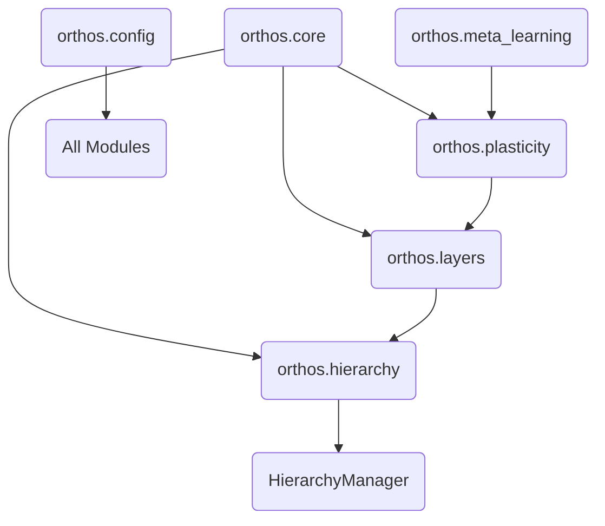

# 🏗️ System Architecture for LLMs

This document provides a high-density overview of the ORTHOS architecture, optimized for LLM context windows and structural reasoning.

## 📦 Module Dependency Graph

## 🧩 Core Components Deep-Dive

### 1. `orthos.core.base.BaseLayer`
The root abstraction. Every processing unit must inherit from this.
- **Contract**: `forward(x)`, `update()`, `reset()`.
- **LLM Note**: When implementing a new layer, ensure `reset()` clears all temporal traces to prevent state leakage between trials.

### 2. `orthos.hierarchy.level.HierarchicalLevel`
A container for one or more layers, operating at a specific `temporal_resolution`.
- **Temporal Resolution**: Level $N$ resolution $R$ means it processes 1 step for every $R$ steps of the raw input.
- **LLM Note**: Data passed to higher levels is typically averaged or sampled. Check `manager.py` for the exact implementation of temporal downsampling.

### 3. `orthos.layers.hebbian.HebbianCore`
The primary plastic layer.
- **Rules**: Supports `hebbian`, `oja`, `bcm`.
- **State**: Weights $W$, fast traces $T_f$, slow traces $T_s$.
- **LLM Note**: Plasticity is usually computed in the `update()` method, not `forward()`, to separate inference from learning.

## 🔄 The Execution Loop

The standard data flow in ORTHOS follows this pattern:

1.  **Initialize**: `HierarchyManager` setup with `HierarchicalLevel`s.
2.  **External Loop**: `for time_step in episode:`
    -   **Feed-forward**: `manager.process(input)`
        -   Iterates through levels.
        -   Applies temporal scaling.
        -   Calls `layer.forward(x)`.
    -   **Adaptation**: `manager.update()` (if training)
        -   Triggers `layer.update()` across the hierarchy.
3.  **Meta-Learning**: (Optional) `ESOptimizer` adjusts plasticity parameters after $N$ episodes.

## 🛠️ Data Shapes & Types

| Object | Shape | Description |
| :--- | :--- | :--- |
| **Input Tensor** | `(batch_size, input_dim)` | Standard input. |
| **Weight Matrix** | `(input_dim, output_dim)` | Connection strengths. |
| **Temporal Trace** | `(output_dim,)` | Decaying activity markers. |
| **ES Population** | `(pop_size, param_count)` | Plasticity parameter variants. |

## ⚠️ Critical Constraints for Agents

1.  **Deterministic Initialization**: Always use the seed from `orthos.config.defaults` if available.
2.  **No Direct Weight Access**: Use `layer.get_weights()` and `layer.set_weights()` to ensure compatibility with potential GPU backends (PyTorch).
3.  **Temporal Consistency**: Ensure that higher levels received the correct temporally-aggregated data.

---

## 📂 Search Patterns for Agents

If you need to find:
- **Math for Oja's rule**: Look in `orthos/plasticity/rules.py`.
- **How levels are added**: Look in `orthos/hierarchy/manager.py`.
- **Logging logic**: Look in `orthos/utils/logging.py`.
- **Default Hyperparameters**: Look in `orthos/config/defaults.py`.
