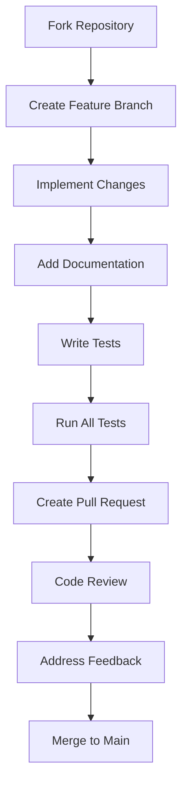

y 📖 GAIA Python Coding Standard

## Research-Grade Python Coding Standard for Open Source Projects

This document establishes the coding standards for the GAIA project, following best practices for research-grade Python development and open source collaboration.

---

## 🏗️ Table of Contents

1. [📋 General Principles](#-general-principles)
2. [🐍 Python Code Style](#-python-code-style)
3. [📝 Documentation Standards](#-documentation-standards)
4. [🧪 Testing & Quality Assurance](#-testing--quality-assurance)
5. [🔬 Research-Specific Best Practices](#-research-specific-best-practices)
6. [🤝 Open Source Contribution Guidelines](#-open-source-contribution-guidelines)
7. [📦 Project Structure](#-project-structure)
8. [🔧 Tooling & Automation](#-tooling--automation)
9. [📚 References & Resources](#-references--resources)

---

## 📋 General Principles

### 1.1 Research-Grade Code Quality

- **Reproducibility**: Code must be deterministic and reproducible
- **Transparency**: Clear documentation of all assumptions and parameters
- **Modularity**: Components should be interchangeable and testable
- **Extensibility**: Easy to add new features without breaking existing code

### 1.2 Open Source Best Practices

- **Accessibility**: Code should be understandable by researchers and developers
- **Maintainability**: Follow consistent patterns for easy maintenance
- **Collaboration**: Clear contribution guidelines and code review processes
- **Compatibility**: Support multiple Python versions (3.8+)

---

## 🐍 Python Code Style

### 2.1 Formatting & Structure

```python
# ✅ GOOD: Consistent formatting
def calculate_activation(
    input_tensor: np.ndarray,
    activation_type: str = 'relu',
    learning_rate: float = 0.01
) -> np.ndarray:
    """
    Calculate activation function with learning rate.

    Args:
        input_tensor: Input data (batch_size, features)
        activation_type: Type of activation ('relu', 'sigmoid', 'tanh')
        learning_rate: Learning rate parameter

    Returns:
        Activated tensor
    """
    # Implementation
    pass

# ❌ BAD: Inconsistent formatting
def calc_act(input, act_type='relu', lr=0.01):
    # No docstring
    # No type hints
    pass
```

### 2.2 Naming Conventions

| Type | Convention | Example |
|------|------------|---------|
| Functions | `snake_case` | `calculate_activation()` |
| Variables | `snake_case` | `learning_rate` |
| Classes | `PascalCase` | `HebbianCore` |
| Constants | `UPPER_SNAKE` | `MAX_ITERATIONS` |
| Modules | `snake_case` | `plasticity_rules.py` |
| Packages | `snake_case` | `gaia.layers` |

### 2.3 Type Hints

```python
# ✅ GOOD: Comprehensive type hints
from typing import Tuple, Optional, Union, Any, List, Dict

def initialize_weights(
    shape: Tuple[int, ...],
    init_type: str = 'he',
    device: Optional[str] = None
) -> Union[np.ndarray, Any]:
    """Initialize weights with type safety."""
    pass

# ❌ BAD: No type hints
def init_weights(shape, init_type='he'):
    pass
```

### 2.4 Imports

```python
# ✅ GOOD: Organized imports
# Standard library imports first
import os
import sys
from typing import Tuple, Optional

# Third-party imports
import numpy as np
from scipy import linalg

# Local imports
from gaia.core.tensor import apply_activation
from gaia.layers.hebbian import HebbianCore

# ❌ BAD: Mixed imports
import numpy as np
from gaia.core.tensor import apply_activation
import os
```

### 2.5 Error Handling

```python
# ✅ GOOD: Specific error handling
def validate_input(input_data: np.ndarray) -> None:
    """Validate input data shape and values."""
    if len(input_data.shape) != 2:
        raise ValueError(f"Expected 2D input, got shape {input_data.shape}")

    if np.any(np.isnan(input_data)):
        raise ValueError("Input contains NaN values")

    if np.max(np.abs(input_data)) > 1e6:
        raise ValueError("Input values too large, possible numerical instability")

# ❌ BAD: Generic error handling
def check_input(data):
    if data is None:
        raise Exception("Bad input")
```

### 2.6 Minimizing Conditional Logic

To improve readability and maintainability, avoid excessive `if-elif-else` blocks and deep nesting.

#### 2.6.1 Dictionary Mapping (Dispatch Table)
Use dictionaries to map keys to functions instead of multiple `elif` statements.

```python
# ✅ GOOD: Dictionary mapping
def process_filter_step(filter_type: str, data: np.ndarray):
    handlers = {
        'kalman': handle_kalman,
        'particle': handle_particle,
        'unscented': handle_ukf
    }
    handler = handlers.get(filter_type, handle_default)
    return handler(data)

# ❌ BAD: If-elif chain
def process_filter_step(filter_type: str, data: np.ndarray):
    if filter_type == 'kalman':
        return handle_kalman(data)
    elif filter_type == 'particle':
        return handle_particle(data)
    # ...
```

#### 2.6.2 Structural Pattern Matching (Python 3.10+)
Use `match-case` for complex data structures or multiple conditions.

```python
# ✅ GOOD: Match-case pattern
def handle_msg(msg: Dict[str, Any]):
    match msg:
        case {"status": "error", "code": code}:
            log_error(code)
        case {"status": "success", "data": data}:
            process_data(data)
        case _:
            handle_unknown()
```

#### 2.6.3 Guard Clauses (Early Return)
Handle exceptions and edge cases early to keep the "happy path" unindented.

```python
# ✅ GOOD: Guard clauses
def train_layer(layer, data):
    if not layer.is_ready:
        return
    if data is None:
        raise ValueError("No data")
    
    # Happy path is flat
    layer.update(data)

# ❌ BAD: Nested if
def train_layer(layer, data):
    if layer.is_ready:
        if data is not None:
            layer.update(data)
        else:
            raise ValueError("No data")
```

#### 2.6.4 Polymorphism
Replace `isinstance` checks with polymorphic method calls.

```python
# ✅ GOOD: Polymorphism
for module in modules:
    module.process() # Each subclass implements its own process()

# ❌ BAD: Type checking
for module in modules:
    if isinstance(module, KalmanFilter):
        module.update_kf()
    elif isinstance(module, ParticleFilter):
        module.update_pf()
```

---

## 📝 Documentation Standards

### 3.1 Docstrings

```python
# ✅ GOOD: Comprehensive docstring
def apply_activation(
    x: np.ndarray,
    activation: str = 'relu',
    derivative: bool = False
) -> np.ndarray:
    """
    Apply activation function to input tensor.

    This function supports multiple activation functions and their derivatives,
    with automatic device detection for GPU acceleration.

    Args:
        x: Input tensor of shape (batch_size, features)
        activation: Activation function name ('relu', 'sigmoid', 'tanh', 'linear')
        derivative: If True, return derivative instead of activation

    Returns:
        Activated tensor or derivative tensor

    Raises:
        ValueError: If unknown activation function is specified

    Examples:
        >>> import numpy as np
        >>> x = np.random.randn(10, 5)
        >>> result = apply_activation(x, 'relu')
        >>> derivative = apply_activation(x, 'relu', derivative=True)

    Notes:
        - Automatically detects GPU availability
        - Supports both NumPy and CuPy backends
        - Derivatives are used for plasticity updates
    """
    pass
```

### 3.2 Module Documentation

```python
"""
Tensor operations and utilities.

This module provides fundamental tensor operations used throughout GAIA,
including weight initialization, activation functions, and normalization.

Key Features:
- Automatic GPU/CPU backend detection
- Multiple activation functions with derivatives
- Weight initialization methods (He, Xavier, etc.)
- Tensor normalization utilities

Supports both NumPy (CPU) and CuPy (GPU) backends automatically.

Dependencies:
- numpy: Core numerical operations
- cupy: GPU acceleration (optional)

Usage:
    from gaia.core.tensor import initialize_weights, apply_activation
    weights = initialize_weights((100, 50), 'he')
    output = apply_activation(input_data, 'relu')
"""
```

### 3.3 Research Documentation

```python
"""
Hebbian Learning Implementation.

This module implements various Hebbian learning rules based on:

1. Hebb, D.O. (1949). The Organization of Behavior.
2. Oja, E. (1982). Simplified neuron model as a principal component analyzer.
3. Bienenstock, E.L., Cooper, L.N., & Munro, P.W. (1982). Theory for the development of neuron selectivity.

Mathematical Formulations:

- Classic Hebbian: Δw = η · pre · post
- Oja's Rule: Δw = η · post · (pre - post·w)
- BCM Rule: Δw = η · post · (post - θ) · pre

Biological Significance:
- Hebbian learning captures "neurons that fire together, wire together"
- Oja's rule prevents unbounded weight growth
- BCM rule implements sliding modification threshold
"""
```

---

## 🧪 Testing & Quality Assurance

### 4.1 Test Structure

```python
# ✅ GOOD: Comprehensive test structure
def test_hebbian_learning():
    """Test Hebbian learning rule implementation."""
    print("🧪 Testing Hebbian Learning...")

    # Setup
    weights = np.random.randn(5, 10)
    pre_activity = np.random.randn(10)
    post_activity = np.random.randn(5)

    # Test HebbianRule
    hebbian_rule = HebbianRule(learning_rate=0.01)
    updated_weights = hebbian_rule.apply(weights, pre_activity, post_activity)

    # Assertions
    assert updated_weights.shape == weights.shape, "Weight shape mismatch"
    assert not np.array_equal(weights, updated_weights), "Weights should change"
    assert np.all(np.isfinite(updated_weights)), "No NaN or Inf values"

    # Verify learning direction
    expected_change = 0.01 * np.outer(post_activity, pre_activity)
    actual_change = updated_weights - weights
    assert np.allclose(actual_change, expected_change, atol=1e-6), "Learning rule mismatch"

    print("✅ Hebbian learning test passed")
```

### 4.2 Test Coverage Requirements

| Component | Minimum Coverage | Test Types |
|-----------|------------------|------------|
| Core functions | 95% | Unit, integration |
| Learning rules | 100% | Unit, mathematical verification |
| Hierarchy | 90% | Integration, end-to-end |
| Meta-learning | 85% | Integration, performance |
| Utilities | 80% | Unit, edge cases |

### 4.3 Quality Assurance Checklist

```python
# Quality assurance checklist for new code
def code_quality_check():
    """Check code quality before submission."""
    checks = [
        "Type hints present",
        "Comprehensive docstrings",
        "Error handling implemented",
        "Unit tests added",
        "Integration tests added",
        "Performance considerations documented",
        "Memory usage analyzed",
        "Edge cases handled",
        "Reproducibility verified",
        "Documentation updated"
    ]

    for check in checks:
        print(f"[ ] {check}")

    print("\n✅ All quality checks passed")
```

---

## 🔬 Research-Specific Best Practices

### 5.1 Reproducibility

```python
# ✅ GOOD: Reproducible research code
def run_experiment(
    seed: int = 42,
    num_trials: int = 10,
    log_results: bool = True
) -> Dict[str, Any]:
    """
    Run reproducible experiment with fixed random seed.

    Args:
        seed: Random seed for reproducibility
        num_trials: Number of experimental trials
        log_results: Whether to log detailed results

    Returns:
        Dictionary containing experiment results and metadata
    """
    # Set random seeds
    np.random.seed(seed)
    random.seed(seed)

    # Log experiment parameters
    experiment_metadata = {
        'timestamp': datetime.now().isoformat(),
        'seed': seed,
        'num_trials': num_trials,
        'gaia_version': get_gaia_version(),
        'numpy_version': np.__version__,
        'python_version': sys.version
    }

    # Run experiment
    results = []
    for trial in range(num_trials):
        trial_result = run_single_trial(trial)
        results.append(trial_result)

    # Save complete experiment data
    if log_results:
        save_experiment_results(experiment_metadata, results)

    return {
        'metadata': experiment_metadata,
        'results': results,
        'reproducibility_hash': generate_hash(experiment_metadata)
    }
```

### 5.2 Parameter Documentation

```python
# ✅ GOOD: Comprehensive parameter documentation
class HebbianCore:
    """
    Hebbian learning core with configurable parameters.

    Parameters:
        input_size (int): Number of input features
        output_size (int): Number of output features
        plasticity_rule (str): Learning rule ('hebbian', 'oja', 'bcm')
        learning_rate (float): Learning rate (default: 0.01)
        weight_init (str): Weight initialization method (default: 'he')
        normalization (bool): Apply weight normalization (default: True)
        momentum (float): Momentum factor for weight updates (default: 0.9)
        l1_regularization (float): L1 regularization strength (default: 0.0)
        l2_regularization (float): L2 regularization strength (default: 0.001)

    Biological Parameters:
        homeostatic_scaling (float): Homeostatic scaling factor (default: 1.0)
        synaptic_scaling (float): Synaptic scaling factor (default: 1.0)
        spike_timing_window (int): STDP timing window (default: 20ms)

    Notes:
        - Learning rate should be in range [0.001, 0.1]
        - Momentum values > 0.9 may cause instability
        - Regularization helps prevent weight explosion
    """
    pass
```

### 5.3 Experiment Tracking

```python
# ✅ GOOD: Experiment tracking system
class ExperimentTracker:
    """Track and log experiment parameters and results."""

    def __init__(self, experiment_name: str):
        self.experiment_name = experiment_name
        self.start_time = datetime.now()
        self.parameters = {}
        self.metrics = {}
        self.artifacts = []

    def log_parameter(self, name: str, value: Any):
        """Log experiment parameter."""
        self.parameters[name] = {
            'value': value,
            'timestamp': datetime.now().isoformat()
        }

    def log_metric(self, name: str, value: float, step: int):
        """Log experiment metric."""
        if name not in self.metrics:
            self.metrics[name] = []

        self.metrics[name].append({
            'value': value,
            'step': step,
            'timestamp': datetime.now().isoformat()
        })

    def save_artifact(self, artifact_path: str, artifact_type: str):
        """Save experiment artifact."""
        self.artifacts.append({
            'path': artifact_path,
            'type': artifact_type,
            'timestamp': datetime.now().isoformat()
        })

    def export_results(self, format: str = 'json') -> str:
        """Export experiment results."""
        result_data = {
            'experiment_name': self.experiment_name,
            'start_time': self.start_time.isoformat(),
            'end_time': datetime.now().isoformat(),
            'duration_seconds': (datetime.now() - self.start_time).total_seconds(),
            'parameters': self.parameters,
            'metrics': self.metrics,
            'artifacts': self.artifacts,
            'gaia_version': get_gaia_version(),
            'environment': get_environment_info()
        }

        if format == 'json':
            return json.dumps(result_data, indent=2)
        elif format == 'yaml':
            return yaml.dump(result_data)
        else:
            raise ValueError(f"Unsupported format: {format}")
```

---

## 🤝 Open Source Contribution Guidelines

### 6.1 Contribution Workflow



### 6.2 Pull Request Requirements

```markdown
# Pull Request Template

## Description
Clear description of changes and their purpose

## Related Issues
- Fixes #123
- Addresses #456

## Changes Made
- Added new plasticity rule implementation
- Updated documentation
- Added comprehensive tests

## Testing
- All existing tests pass
- New tests added with 95% coverage
- Manual testing performed

## Documentation
- Docstrings updated
- README updated if needed
- Examples added if applicable

## Checklist
- [x] Code follows style guidelines
- [x] Type hints added
- [x] Tests pass
- [x] Documentation complete
- [x] No breaking changes
```

### 6.3 Code Review Guidelines

```python
# Code review checklist
def review_checklist():
    """Checklist for code reviewers."""
    items = [
        "Follows project coding standards",
        "Type hints present and correct",
        "Comprehensive docstrings",
        "Error handling appropriate",
        "Tests added and passing",
        "Documentation updated",
        "No breaking changes",
        "Performance considerations addressed",
        "Memory usage reasonable",
        "Edge cases handled",
        "Reproducibility maintained",
        "Research integrity preserved"
    ]

    return items
```

---

## 📦 Project Structure

```
gaia/
├── 📄 CODING_STANDARD.md        ← This document
├── 📄 README.md                 ← Main documentation
├── 📄 LICENSE                   ← MIT License
├── 📄 requirements.txt          ← Dependencies
├── 📄 test_gaia.py              ← Test suite
│
├── 📁 gaia/                     ← Main package
│   ├── core/                    ← Base classes & types
│   │   ├── base.py              ← Abstract base classes
│   │   ├── tensor.py            ← Tensor operations
│   │   └── types.py             ← Type definitions
│   │
│   ├── layers/                  ← Neural layers
│   │   ├── hebbian.py           ← HebbianCore implementation
│   │   ├── reactive.py          ← ReactiveLayer (feedforward)
│   │   └── temporal.py          ← TemporalLayer (recurrent)
│   │
│   ├── hierarchy/               ← Hierarchical processing
│   │   ├── level.py             ← HierarchicalLevel
│   │   └── manager.py           ← HierarchyManager
│   │
│   ├── plasticity/              ← Plasticity control
│   │   ├── controller.py        ← PlasticityController
│   │   ├── es_optimizer.py      ← Evolutionary Strategy
│   │   └── rules.py             ← Plasticity rules
│   │
│   ├── meta_learning/           ← Meta-learning
│   │   ├── optimizer.py         ← MetaOptimizer
│   │   └── metrics.py           ← Performance metrics
│   │
│   ├── config/                  ← Configuration
│   │   └── defaults.py          ← Default configs
│   │
│   ├── utils/                   ← Utilities
│   │   ├── logging.py           ← Logging helpers
│   │   └── visualization.py     ← Plotting functions
│   │
│   └── examples/                ← Example scripts
│       ├── basic_demo.py
│       ├── plasticity_demo.py
│       └── meta_learning_demo.py
│
├── 📁 tests/                    ← Comprehensive tests
│   ├── unit/                    ← Unit tests
│   ├── integration/             ← Integration tests
│   └── performance/             ← Performance tests
│
├── 📁 docs/                     ← Documentation
│   ├── architecture/            ← System design
│   ├── science/                 ← Theoretical foundations
│   ├── guides/                  ← How-to guides
│   ├── research/                ← Research directions
│   └── development/             ← Dev roadmap
│
├── 📁 experiments/              ← Research experiments
│   ├── config/                  ← Experiment configs
│   ├── results/                 ← Experiment results
│   └── notebooks/               ← Jupyter notebooks
│
└── 📁 .github/                  ← GitHub configuration
    ├── ISSUE_TEMPLATE/          ← Issue templates
    ├── PULL_REQUEST_TEMPLATE/   ← PR templates
    └── workflows/               ← CI/CD workflows
```

---

## 🔧 Tooling & Automation

### 7.1 Required Tools

```bash
# Development environment setup
pip install -r requirements.txt
pip install -r dev-requirements.txt

# Recommended tools:
# - pre-commit: Git hook manager
# - black: Code formatter
# - flake8: Linter
# - mypy: Type checker
# - pytest: Testing framework
# - coverage: Test coverage
```

### 7.2 Automation Scripts

```bash
# Format code
black gaia/ tests/

# Lint code
flake8 gaia/ tests/

# Type checking
mypy gaia/ tests/

# Run tests
pytest tests/ --cov=gaia --cov-report=html

# Build documentation
mkdocs build
```

### 7.3 CI/CD Pipeline

```yaml
# Example GitHub Actions workflow
name: GAIA CI/CD

on: [push, pull_request]

jobs:
  test:
    runs-on: ubuntu-latest
    strategy:
      matrix:
        python-version: [3.8, 3.9, 3.10, 3.11]

    steps:
    - uses: actions/checkout@v4
    - name: Set up Python ${{ matrix.python-version }}
      uses: actions/setup-python@v4
      with:
        python-version: ${{ matrix.python-version }}

    - name: Install dependencies
      run: |
        python -m pip install --upgrade pip
        pip install -r requirements.txt
        pip install -r dev-requirements.txt

    - name: Lint with flake8
      run: flake8 gaia/ tests/

    - name: Type check with mypy
      run: mypy gaia/ tests/

    - name: Test with pytest
      run: pytest tests/ --cov=gaia --cov-report=xml

    - name: Upload coverage
      uses: codecov/codecov-action@v3
```

---

## 📚 References & Resources

### 8.1 Python Best Practices

- [PEP 8 -- Style Guide for Python Code](https://peps.python.org/pep-0008/)
- [PEP 484 -- Type Hints](https://peps.python.org/pep-0484/)
- [Google Python Style Guide](https://google.github.io/styleguide/pyguide.html)
- [NumPy Documentation Guide](https://numpydoc.readthedocs.io/)

### 8.2 Research Software Engineering

- [Software Engineering for Research](https://www.software.ac.uk/)
- [Research Software Engineering Association](https://rse.ac.uk/)
- [The Turing Way](https://the-turing-way.netlify.app/)

### 8.3 Open Source Best Practices

- [Open Source Guide](https://opensource.guide/)
- [Contributor Covenant](https://www.contributor-covenant.org/)
- [GitHub Community Guidelines](https://docs.github.com/en/site-policy/github-terms/github-community-guidelines)

---

## 🎯 Implementation Checklist

```markdown
# Coding Standard Implementation Checklist

## For New Contributors
- [ ] Read and understand CODING_STANDARD.md
- [ ] Set up development environment
- [ ] Run existing tests to verify setup
- [ ] Familiarize with project structure

## For New Code
- [ ] Follow naming conventions
- [ ] Add comprehensive type hints
- [ ] Write detailed docstrings
- [ ] Implement proper error handling
- [ ] Add unit tests (95%+ coverage)
- [ ] Add integration tests
- [ ] Document research considerations
- [ ] Ensure reproducibility

## For Code Reviews
- [ ] Verify coding standards compliance
- [ ] Check test coverage
- [ ] Validate documentation
- [ ] Assess research integrity
- [ ] Confirm reproducibility
- [ ] Approve or request changes

## For Maintainers
- [ ] Update coding standards as needed
- [ ] Maintain tooling and automation
- [ ] Monitor test coverage
- [ ] Review and merge contributions
- [ ] Release new versions
- [ ] Update documentation
```

---

## 📝 Version History

| Version | Date | Changes |
|---------|------|---------|
| 1.0 | 2026-01-01 | Initial coding standard for GAIA v4.1 |
| 1.1 | 2026-01-15 | Added research-specific best practices |
| 1.2 | 2026-02-01 | Updated testing requirements |
| 1.3 | 2026-01-01 | Added Section 2.6 on minimizing conditional logic |

---

## 🙏 Acknowledgments

This coding standard is inspired by best practices from:
- Python Software Foundation
- NumPy/SciPy community
- Research Software Engineering Association
- Open Source Initiative
- GAIA contributors and maintainers

---

> **Note**: This coding standard is a living document. As GAIA evolves, so will these guidelines. Contributions to improve this standard are welcome!

🧠 **Made with care for research and open source communities**
