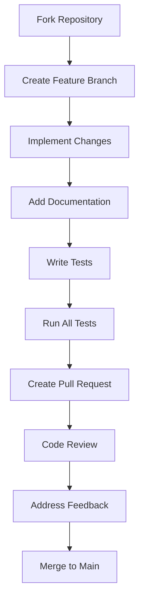

# 🤝 Contributing to GAIA

## Welcome to the GAIA Community!

Thank you for your interest in contributing to GAIA! This document provides guidelines for contributing to the project and following our coding standards.

---

## 🏗️ Table of Contents

1. [📋 Getting Started](#-getting-started)
2. [📖 Coding Standards](#-coding-standards)
3. [🔧 Development Setup](#-development-setup)
4. [🧪 Testing](#-testing)
5. [📝 Documentation](#-documentation)
6. [🤝 Contribution Workflow](#-contribution-workflow)
7. [🎯 Research Contributions](#-research-contributions)
8. [📚 Resources](#-resources)

---

## 📋 Getting Started

### 1.1 Prerequisites

- Python 3.8+
- Git
- Basic understanding of neural networks and plasticity

### 1.2 Fork and Clone

```bash
# Fork the repository on GitHub
git clone https://github.com/YOUR_USERNAME/gaia.git
cd gaia
```

### 1.3 Install Dependencies

```bash
# Install main dependencies
pip install -r requirements.txt

# Install development dependencies
pip install -r dev-requirements.txt

# Set up pre-commit hooks
pre-commit install
```

---

## 📖 Coding Standards

GAIA follows a comprehensive coding standard documented in [CODING_STANDARD.md](CODING_STANDARD.md).

### 2.1 Key Principles

- **Type hints**: All functions must have comprehensive type hints
- **Documentation**: Detailed docstrings following NumPy style
- **Testing**: 95%+ test coverage for core functionality
- **Reproducibility**: Research code must be deterministic

### 2.2 Code Quality Tools

GAIA uses several tools to maintain code quality:

| Tool | Purpose | Configuration |
|------|---------|---------------|
| **black** | Code formatting | `.pre-commit-config.yaml` |
| **isort** | Import sorting | `.pre-commit-config.yaml` |
| **flake8** | Linting | `.pre-commit-config.yaml` |
| **mypy** | Type checking | `.pre-commit-config.yaml` |
| **pytest** | Testing | `dev-requirements.txt` |
| **pre-commit** | Git hooks | `.pre-commit-config.yaml` |

### 2.3 Running Code Quality Checks

```bash
# Run all pre-commit hooks
pre-commit run --all-files

# Format code
black gaia/ tests/

# Lint code
flake8 gaia/ tests/

# Type checking
mypy gaia/ tests/

# Run tests
pytest tests/
```

---

## 🔧 Development Setup

### 3.1 Recommended Setup

```bash
# Create virtual environment
python -m venv venv
source venv/bin/activate  # Linux/Mac
# venv\Scripts\activate  # Windows

# Install dependencies
pip install -r requirements.txt
pip install -r dev-requirements.txt

# Set up pre-commit
pre-commit install
```

### 3.2 IDE Configuration

**VS Code** (recommended):
```json
{
  "python.linting.enabled": true,
  "python.linting.flake8Enabled": true,
  "python.linting.mypyEnabled": true,
  "python.formatting.provider": "black",
  "python.linting.pylintEnabled": false,
  "editor.formatOnSave": true,
  "editor.defaultFormatter": "ms-python.black-formatter",
  "[python]": {
    "editor.codeActionsOnSave": {
      "source.organizeImports": true
    }
  }
}
```

**PyCharm**:
- Enable Black formatter
- Enable mypy inspection
- Enable flake8 inspection
- Set line length to 88 characters

---

## 🧪 Testing

### 4.1 Test Structure

```
tests/
├── unit/          # Unit tests
├── integration/   # Integration tests
└── performance/   # Performance tests
```

### 4.2 Running Tests

```bash
# Run all tests
pytest tests/

# Run specific test file
pytest tests/unit/test_tensor.py

# Run tests with coverage
pytest tests/ --cov=gaia --cov-report=html

# Run tests in parallel
pytest tests/ -n auto
```

### 4.3 Test Coverage Requirements

| Component | Minimum Coverage |
|-----------|------------------|
| Core functions | 95% |
| Learning rules | 100% |
| Hierarchy | 90% |
| Meta-learning | 85% |
| Utilities | 80% |

### 4.4 Writing Tests

```python
# Example test structure
def test_hebbian_learning():
    """Test Hebbian learning rule implementation."""
    # Setup
    weights = np.random.randn(5, 10)
    pre_activity = np.random.randn(10)
    post_activity = np.random.randn(5)

    # Test
    hebbian_rule = HebbianRule(learning_rate=0.01)
    updated_weights = hebbian_rule.apply(weights, pre_activity, post_activity)

    # Assertions
    assert updated_weights.shape == weights.shape
    assert not np.array_equal(weights, updated_weights)
    assert np.all(np.isfinite(updated_weights))

    # Verify learning direction
    expected_change = 0.01 * np.outer(post_activity, pre_activity)
    actual_change = updated_weights - weights
    assert np.allclose(actual_change, expected_change, atol=1e-6)
```

---

## 📝 Documentation

### 5.1 Documentation Standards

GAIA follows NumPy-style docstrings:

```python
def apply_activation(
    x: np.ndarray,
    activation: str = 'relu',
    derivative: bool = False
) -> np.ndarray:
    """
    Apply activation function to input tensor.

    This function supports multiple activation functions and their derivatives,
    with automatic device detection for GPU acceleration.

    Args:
        x: Input tensor of shape (batch_size, features)
        activation: Activation function name ('relu', 'sigmoid', 'tanh', 'linear')
        derivative: If True, return derivative instead of activation

    Returns:
        Activated tensor or derivative tensor

    Raises:
        ValueError: If unknown activation function is specified

    Examples:
        >>> import numpy as np
        >>> x = np.random.randn(10, 5)
        >>> result = apply_activation(x, 'relu')
        >>> derivative = apply_activation(x, 'relu', derivative=True)

    Notes:
        - Automatically detects GPU availability
        - Supports both NumPy and CuPy backends
        - Derivatives are used for plasticity updates
    """
    pass
```

### 5.2 Building Documentation

```bash
# Build MkDocs documentation
mkdocs build

# Serve documentation locally
mkdocs serve

# Generate API documentation
pdoc --html gaia --output-dir docs/api
```

---

## 🤝 Contribution Workflow

### 6.1 Step-by-Step Guide



### 6.2 Branch Naming

| Type | Format | Example |
|------|--------|---------|
| Feature | `feature/description` | `feature/new-plasticity-rule` |
| Bugfix | `bugfix/description` | `bugfix/hebbian-learning` |
| Documentation | `docs/description` | `docs/api-reference` |
| Research | `research/description` | `research/stdp-implementation` |

### 6.3 Pull Request Template

```markdown
# Pull Request Template

## Description
Clear description of changes and their purpose

## Related Issues
- Fixes #123
- Addresses #456

## Changes Made
- Added new plasticity rule implementation
- Updated documentation
- Added comprehensive tests

## Testing
- All existing tests pass
- New tests added with 95% coverage
- Manual testing performed

## Documentation
- Docstrings updated
- README updated if needed
- Examples added if applicable

## Checklist
- [x] Code follows style guidelines
- [x] Type hints added
- [x] Tests pass
- [x] Documentation complete
- [x] No breaking changes
```

### 6.4 Code Review Process

1. **Automated Checks**: Pre-commit hooks run automatically
2. **Manual Review**: Maintainers review code quality and research integrity
3. **Feedback**: Address all review comments
4. **Approval**: Requires at least one maintainer approval
5. **Merge**: Code is merged to main branch

---

## 🎯 Research Contributions

### 7.1 Research Guidelines

- **Reproducibility**: All experiments must be reproducible
- **Documentation**: Comprehensive documentation of methods and results
- **Validation**: Statistical validation of research findings
- **Ethics**: Follow ethical guidelines for AI research

### 7.2 Experiment Structure

```
experiments/
├── config/          # Experiment configurations
├── results/         # Experiment results
├── notebooks/       # Jupyter notebooks
└── scripts/         # Experiment scripts
```

### 7.3 Research Checklist

```markdown
# Research Contribution Checklist

## Experimental Design
- [ ] Clear research question defined
- [ ] Hypothesis stated
- [ ] Experimental protocol documented
- [ ] Control conditions included

## Implementation
- [ ] Code follows GAIA standards
- [ ] Reproducibility ensured
- [ ] Performance metrics defined
- [ ] Statistical tests implemented

## Documentation
- [ ] Methods section complete
- [ ] Results section complete
- [ ] Discussion section complete
- [ ] References included

## Validation
- [ ] Results validated
- [ ] Statistical significance confirmed
- [ ] Edge cases tested
- [ ] Robustness analysis performed
```

---

## 📚 Resources

### 8.1 Learning Resources

- [GAIA Documentation](docs/)
- [Coding Standard](CODING_STANDARD.md)
- [Research Guide](docs/research/)
- [API Reference](docs/api/)

### 8.2 Community

- [GitHub Issues](https://github.com/kelaci/gaia/issues)
- [GitHub Discussions](https://github.com/kelaci/gaia/discussions)
- [Contributor Guide](CONTRIBUTING.md)

### 8.3 Best Practices

- [Python Best Practices](https://peps.python.org/)
- [Research Software Engineering](https://rse.ac.uk/)
- [Open Source Guide](https://opensource.guide/)

---

## 🙏 Thank You!

Your contributions help advance GAIA and the field of adaptive intelligent architectures. We appreciate your time and effort!

> **Note**: This document is a living guide. As GAIA evolves, so will these contribution guidelines. Your feedback is welcome!

🧠 **Made with care by the GAIA community**
